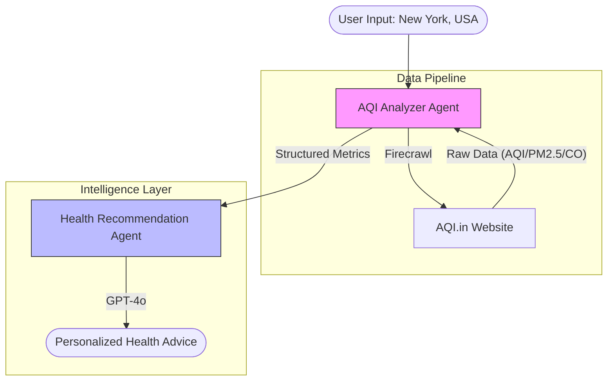

# AQI Analysis Agent 🌍
> **Real-Time Air Quality Monitoring & Health Advice**

[](https://github.com/Hazbilal3)
[](https://opensource.org/licenses/MIT)
[](https://www.firecrawl.dev/)
[](https://github.com/agno-agi/agno)

The **AQI Analysis Agent** is a life-saving tool that combines real-time data extraction with medical-grade AI analysis. It scrapes live air quality data (AQI, PM2.5, CO) for any city on Earth and generates personalized health recommendations based on your specific medical conditions and planned activities.


## 🏗 Architecture



## ✨ Metrics Tracked
- **AQI (Air Quality Index)**: Overall health impact score.
- **Particulate Matter (PM2.5 & PM10)**: Fine particles that affect lungs/bloodstream.
- **Carbon Monoxide (CO)**: Dangerous gas levels.
- **Weather Context**: Temperature, Humidity, and Wind Speed correlations.

## 🚀 Quick Start

### Prerequisites
- Python 3.10+
- **OpenAI API Key** (for reasoning)
- **Firecrawl API Key** (for real-time scraping)

### Installation

1. **Clone the repository**
   ```bash
   git clone https://github.com/Hazbilal3/aqi_analysis_agent.git
   cd advanced_ai_agents/multi_agent_apps/aqi_analysis_agent
   ```

2. **Install dependencies**
   ```bash
   pip install -r requirements.txt
   ```

3. **Run the Application**
   ```bash
   streamlit run ai_aqi_analysis_agent_streamlit.py
   ```

4. **Configure Keys**: Enter your API keys in the sidebar.

## 💡 How It Works
1. **Extraction**: The `AQIAnalyzer` agent uses Firecrawl to navigate to live dashboards (like `aqi.in`) and extract specific sensor data.
2. **Analysis**: The `HealthRecommendationAgent` receives this raw data + your context (e.g., "I have asthma and want to jog").
3. **Recommendation**: It synthesizes a safety report, advising on specific precautions or suggesting alternative times.

---

**Created by [Hazbilal3](https://github.com/Hazbilal3)**
