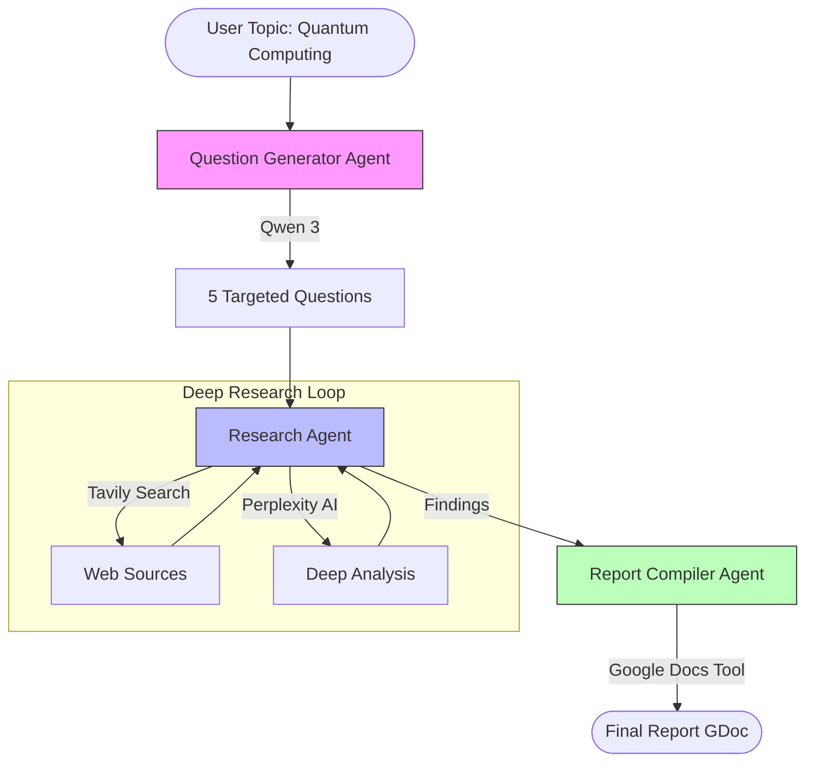

# Deep Research Agent 🔍
> **Automated Multi-Source Research & Reporting**

[](https://github.com/Dan-445)
[](https://opensource.org/licenses/MIT)
[](https://github.com/agno-agi/agno)
[](https://composio.ai/)

The **Deep Research Agent** is a sophisticated AI analyst capable of conducting autonomous deep-dives into any topic. It breaks down complex subjects into specific research questions, investigates them using multiple search engines (Tavily, Perplexity), and compiles a professional McKinsey-style report directly into Google Docs.


## 🏗 Architecture



## ✨ Capabilities
- **Intelligent Scoping**: Automatically breaks broad topics into 5 precise, researchable yes/no questions.
- **Multi-Source Verification**: Cross-references findings from standard web search (Tavily) and AI-driven answer engines (Perplexity).
- **Automated Reporting**: Synthesizes findings into a cohesive narrative (not just a bulleted list) and formats it in a Google Doc.
- **Professional Output**: Produces reports structured with Executive Summaries, Analysis, and Strategic Implications.

## 🚀 Quick Start

### Prerequisites
- Python 3.10+
- **Together AI API Key** (for LLM inference)
- **Composio API Key** (for tool integrations: Google Docs, search)

### Installation

1. **Clone the repository**
   ```bash
   git clone https://github.com/Dan-445/awesome-llm-apps.git
   cd advanced_ai_agents/multi_agent_apps/deep_research_agent
   ```

2. **Install dependencies**
   ```bash
   pip install -r requirements.txt
   ```

3. **Install Composio Tools**
   ```bash
   composio add googledocs
   composio add perplexityai
   ```

4. **Run the Agent**
   ```bash
   streamlit run ai_domain_deep_research_agent.py
   ```

## 🛠 Configuration
Enter your API keys in the sidebar configuration panel to unlock the agent's full capabilities.

---

**Created by [Dan-445](https://github.com/Dan-445)**
