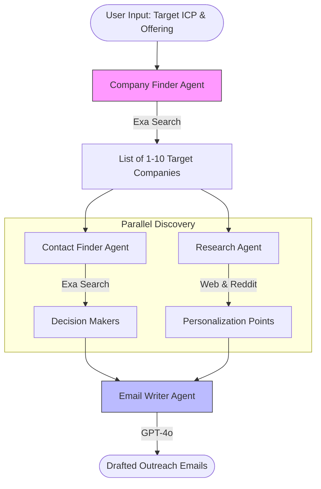

# AI Email GTM Outreach Agent 📧
> **Autonomous Multi-Agent Sales Development**

[](https://github.com/Dan-445)
[](https://opensource.org/licenses/MIT)
[](https://github.com/agno-agi/agno)
[](https://exa.ai/)

The **Email GTM Outreach Agent** is an autonomous sales team in a box. It doesn't just write emails; it finds target companies, identifies key decision makers, researches them deeply (using their website and Reddit presence), and writes highly personalized, relevant outreach that converts.


## 🏗 Architecture



## ✨ Capabilities
- **Autonomous Prospecting**: Finds companies fitting your ICP (Ideal Customer Profile) without manual lists.
- **Deep Research**: Scrapes company websites and Reddit discussions to find specific pain points or news.
- **Decision Maker Identification**: Locates founders, sales leads, and marketing heads automatically.
- **Style-Adapted Writing**: Drafts emails in multiple styles:
  - *Professional*: Formal and respectful.
  - *Casual*: Low-friction and friendly.
  - *Cold*: Direct, hook-focused.
  - *Consultative*: Insight-led and value-first.

## 🚀 Quick Start

### Prerequisites
- Python 3.10+
- **OpenAI API Key** (for reasoning and writing)
- **Exa API Key** (for reliable company & contact search)

### Installation

1. **Clone the repository**
   ```bash
   git clone https://github.com/Dan-445/awesome-llm-apps.git
   cd advanced_ai_agents/multi_agent_apps/email_outreach_agent
   ```

2. **Install dependencies**
   ```bash
   pip install -r requirements.txt
   ```

3. **Run the Application**
   ```bash
   streamlit run ai_email_gtm_outreach_agent.py
   ```

## 🛠 Configuration
Enter your keys in the sidebar. Select your target count (1-10) and one of the 4 writing styles to begin.

---

**Created by [Dan-445](https://github.com/Dan-445)**
