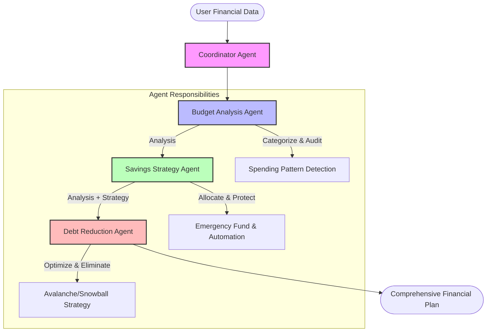

# Financial Advisor Agent 💰
> **Personalized Wealth Management | Multi-Agent System**

[](https://github.com/Dan-445)
[](https://opensource.org/licenses/MIT)
[](https://github.com/google/generative-ai-python)
[](https://deepmind.google/technologies/gemini/)

The **Financial Advisor Agent** is a sophisticated multi-agent system designed to act as your personal CFO. Powered by Google's Agent Development Kit (ADK) and Gemini 2.5, it orchestrates specialized agents to analyze your budget, optimize savings, and destroy debt.

## 🏗 Architecture



## ✨ Specialized Agents

### 1. 📊 Budget Analysis Agent
- **Role**: The Auditor
- **Function**: Ingests transaction data (CSV or manual), categorizes expenses, and identifies leakage.
- **Output**: Detailed spending breakdown and immediate cost-cutting recommendations.

### 2. 🐷 Savings Strategy Agent
- **Role**: The Planner
- **Function**: Calculates optimal emergency fund size and allocates surplus income to high-yield goals.
- **Output**: Automation techniques and staged savings targets.

### 3. 💳 Debt Reduction Agent
- **Role**: The Strategist
- **Function**: mathematically optimizes debt payoff using Avalanche (save interest) vs. Snowball (psychological wins) methods.
- **Output**: Exact payoff timeline and total interest savings.

## 🚀 Quick Start

### Prerequisites
- Python 3.10+
- Google API Key (Gemini)

### Installation

1. **Clone the repository**
   ```bash
   git clone https://github.com/Dan-445/awesome-llm-apps.git
   cd advanced_ai_agents/multi_agent_apps/financial_advisor_agent
   ```

2. **Install dependencies**
   ```bash
   pip install -r requirements.txt
   ```

3. **Configure Environment**
   Create a `.env` file:
   ```bash
   GOOGLE_API_KEY=your_actual_api_key_here
   ```

4. **Run the Advisor**
   ```bash
    streamlit run financial_advisor_agent.py
    ```

## 📊 Data Privacy
This agent runs **locally**. Your financial data (income, debts, transactions) is processed in-memory during the session and is **never** stored permanently or transmitted to third parties other than the LLM for inference.

---

**Created by [Dan-445](https://github.com/Dan-445)**
