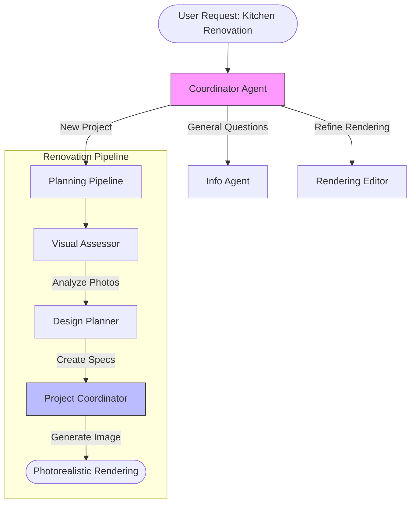

# AI Home Renovation Planner 🏗️
> **Intelligent Design & Visualization using Gemini 2.5**

[](https://github.com/Dan-445)
[](https://opensource.org/licenses/MIT)
[](https://github.com/google/adk)
[](https://deepmind.google/technologies/gemini/)

The **AI Home Renovation Planner** is a multimodal agent system that turns photos of your outdated space into fully planned, photorealistic renovation projects. It uses Google's Agent Development Kit (ADK) and the Gemini 2.5 Flash model to analyze room conditions, understand style inspiration, calculate costs, and generate stunning visualizations of the final result.


## 🏗 Architecture

This agent implements the **Coordinator/Dispatcher Pattern**, routing requests between a quick-response info agent and a sophisticated planning pipeline.



## ✨ Capabilities
- **Visual Intelligence**: Upload a photo of your current room, and the agent "sees" the dimensions, condition, and opportunities.
- **Style Transfer**: Upload a Pinterest inspiration photo, and the agent extracts the aesthetic to apply to your space.
- **Budget-Aware Planning**: Provides realistic cost estimates based on 2024 data for materials and labor.
- **Photorealistic Visualization**: Generates high-fidelity 8K render of your renovated room using Gemini's image generation capabilities.
- **Iterative Design**: Don't like the color? Just say "make the cabinets sage green," and the Rendering Editor updates the visualization.

## 🚀 Quick Start

### Prerequisites
- Python 3.10+
- **Google API Key** (access to Gemini 2.5 Flash)

### Installation

1. **Clone the repository**
   ```bash
   git clone https://github.com/Dan-445/awesome-llm-apps.git
   cd advanced_ai_agents/multi_agent_apps/home_renovation_agent
   ```

2. **Install dependencies**
   ```bash
   pip install -r requirements.txt
   ```

3. **Set up API Key**
   ```bash
   export GOOGLE_API_KEY="your_gemini_api_key"
   ```

4. **Launch the Agent** (via ADK Web)
   ```bash
   adk web
   ```

## 💡 How It Works
1. **Assessment**: The `VisualAssessor` scans your room photo: *"It's a 10x12 kitchen with dated oak cabinets."*
2. **Planning**: The `DesignPlanner` creates a spec: *"Replace customized cabinets with white shaker style, add quartz counters. Est cost: $15k."*
3. **Visualization**: The `ProjectCoordinator` synthesizes these specs into a complex prompt for Gemini to generate the "after" photo.

---

**Created by [Dan-445](https://github.com/Dan-445)**
