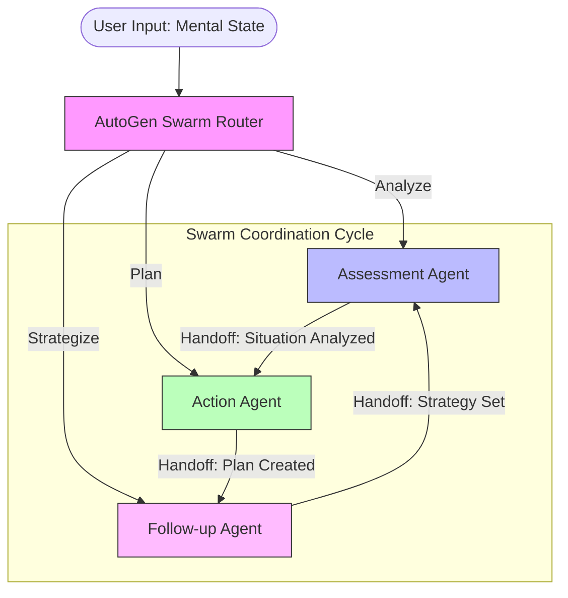

# AI Mental Wellbeing Agent 🧠
> **Compassionate AI Support Team powered by AutoGen Swarm**

[](https://github.com/Dan-445)
[](https://opensource.org/licenses/MIT)
[-blue.svg)](https://github.com/ag2ai/ag2)
[](https://streamlit.io/)

The **AI Mental Wellbeing Agent** is a supportive system providing personalized mental health guidance. Built on **AG2 (formerly AutoGen)**, it uses the **Swarm Architecture** to coordinate a team of specialized agents that assess your emotional state, provide immediate coping strategies, and design long-term wellness plans.

## 🏗 Architecture

This application uses the **Swarm Pattern**, where agents can hand off tasks to one another in a coordinated loop to provide comprehensive care.



## ✨ Specialized Agent Team

- **🧠 Assessment Agent**: A clinical empathy specialist. Analyzes your emotional state, identifies patterns, and validates your feelings without judgment.
- **🎯 Action Agent**: A crisis intervention & resource specialist. providing immediate, evidence-based coping strategies and connecting you to professional resources.
- **🔄 Follow-up Agent**: A recovery planner. Designs long-term support strategies, habits, and relapse prevention plans tailored to your life.

## 🚀 Quick Start

### Prerequisites
- Python 3.10+
- **OpenAI API Key** (for clinical reasoning and empathy)

### Installation

1. **Clone the repository**
   ```bash
   git clone https://github.com/Dan-445/awesome-llm-apps.git
   cd advanced_ai_agents/multi_agent_apps/mental_wellbeing_agent
   ```

2. **Install dependencies**
   ```bash
   pip install -r requirements.txt
   ```

3. **Configure Environment**
   Create a `.env` file to disable Docker usage for local execution:
   ```bash
   echo "AUTOGEN_USE_DOCKER=0" > .env
   ```

4. **Run the Application**
   ```bash
   streamlit run ai_mental_wellbeing_agent.py
   ```

## ⚠️ Important Notice
This tool is for **support and guidance only** and does NOT replace professional medical advice.
**If you are in crisis:**
- Call **988** (National Crisis Hotline)
- Call **911** (Emergency Services)
- Go to the nearest emergency room

---

**Created by [Dan-445](https://github.com/Dan-445)**
