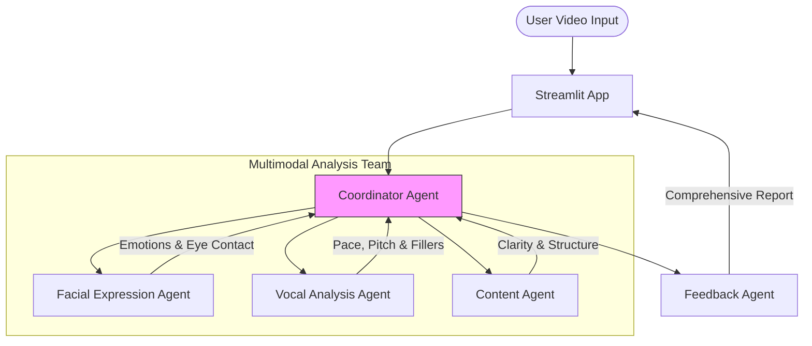

# AI Speech Trainer Agent 🎙️
> **Multimodal Public Speaking Coach powered by Agno**

[-blue.svg)](https://github.com/Dan-445)
[](https://opensource.org/licenses/MIT)
[](https://github.com/agno-agi/agno)
[]()

The **AI Speech Trainer** is a multimodal coach that helps you master public speaking. By analyzing your video presentations, it evaluates your facial expressions, voice modulation, and speech content to provide comprehensive, actionable feedback.

## 🏗 Architecture

The system employs a collaborative team of specialized agents, orchestrated by a central Coordinator.



## ✨ Features

- **🙂 Facial Analysis**: Tracks emotions, eye contact, and engagement using OpenCV & DeepFace.
- **🗣️ Vocal Analysis**: Detects speech pace, pitch variations, clarity, and filler words using Whisper & Librosa.
- **📝 Content Evaluation**: Analyzes your speech text for structure, tone, and persuasiveness using GPT-4o/Llama.
- **📊 Comprehensive Scoring**: Provides an aggregated score based on a professional rubric with specific strengths and weaknesses.

## 🚀 Quick Start

### Prerequisites
- Python 3.10+
- **Together AI API Key** (configured in `.env` or UI)
- `ffmpeg` installed on your system (for audio processing)

### Installation

1. **Clone the repository**
   ```bash
   git clone https://github.com/Dan-445/awesome-llm-apps.git
   cd advanced_ai_agents/multi_agent_apps/speech_trainer_agent
   ```

2. **Install dependencies**
   ```bash
   pip install -r requirements.txt
   ```

3. **Configure Environment**
   Create a `.env` file (optional, or enter in UI):
   ```bash
   TOGETHER_API_KEY=your_api_key_here
   ```

4. **Run the Application**
   ```bash
   streamlit run main.py
   ```

5. **Usage**
   - Open the Streamlit app in your browser.
   - Upload a short video clip (15-30s recommended for demo).
   - Click "Analyze" and wait for your personalized feedback report.

## 🛠 Tech Stack
- **Frontend**: Streamlit
- **Agent Framework**: Agno
- **AI Models**: Llama-3.3-70B (via Together AI), Faster-Whisper, DeepFace

---

**Created by [Danish (Dan-445)](https://github.com/Dan-445)**